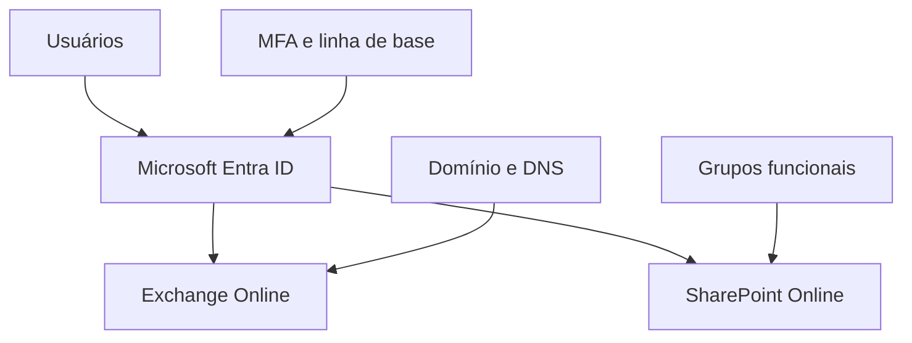

# Arquitetura lógica

```mermaid
flowchart TB
    USERS["Usuários"] --> ENTRA["Microsoft Entra ID"]
    ENTRA --> EXO["Exchange Online"]
    ENTRA --> SPO["SharePoint Online"]
    GROUPS["Grupos funcionais"] --> SPO
    DOMAIN["Domínio e DNS"] --> EXO
    BASELINE["MFA e linha de base"] --> ENTRA
```

O diagrama apresenta somente os componentes relevantes à documentação pública.
