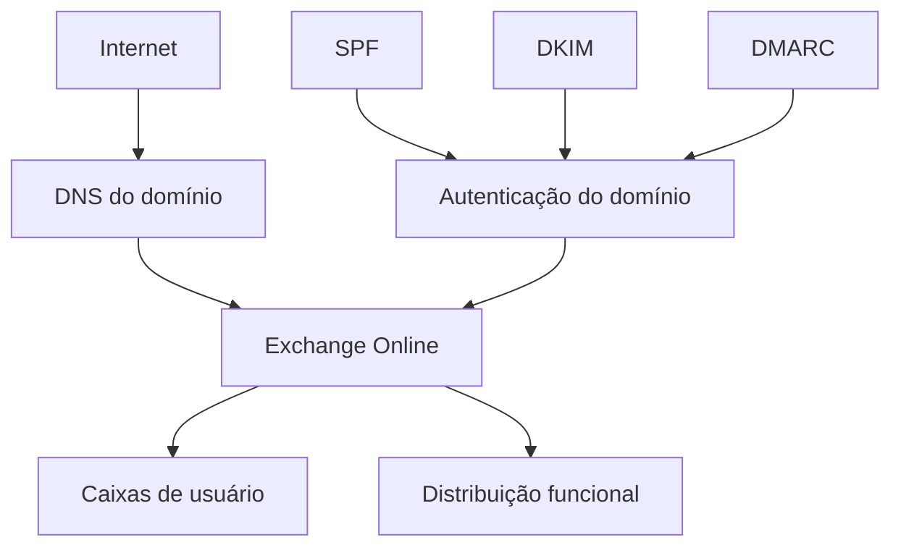

# Fluxo de e-mail

```mermaid
flowchart TB
    INTERNET["Internet"] --> DNS["DNS do domínio"]
    DNS --> EXCHANGE["Exchange Online"]
    EXCHANGE --> MAILBOX["Caixas de usuário"]
    EXCHANGE --> GROUP["Distribuição funcional"]
    SPF["SPF"] --> CHECK["Autenticação do domínio"]
    DKIM["DKIM"] --> CHECK
    DMARC["DMARC"] --> CHECK
    CHECK --> EXCHANGE
```

O desenho não contém rotas, endereços, políticas ou valores DNS reais.
