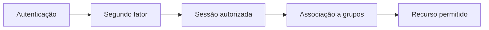

# Fluxo de identidade e acesso

```mermaid
flowchart LR
    AUTH["Autenticação"] --> MFA["Segundo fator"]
    MFA --> TOKEN["Sessão autorizada"]
    TOKEN --> MEMBERSHIP["Associação a grupos"]
    MEMBERSHIP --> RESOURCE["Recurso permitido"]
```

Os nomes e as associações reais foram omitidos. O fluxo não representa políticas personalizadas de Acesso Condicional.
