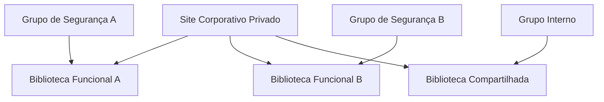

# Organização documental

```mermaid
flowchart TB
    SITE["Site Corporativo Privado"] --> L1["Biblioteca Funcional A"]
    SITE --> L2["Biblioteca Funcional B"]
    SITE --> L3["Biblioteca Compartilhada"]
    G1["Grupo de Segurança A"] --> L1
    G2["Grupo de Segurança B"] --> L2
    GI["Grupo Interno"] --> L3
```

A quantidade e a topologia são ilustrativas e não permitem reconstruir a matriz real de permissões.
