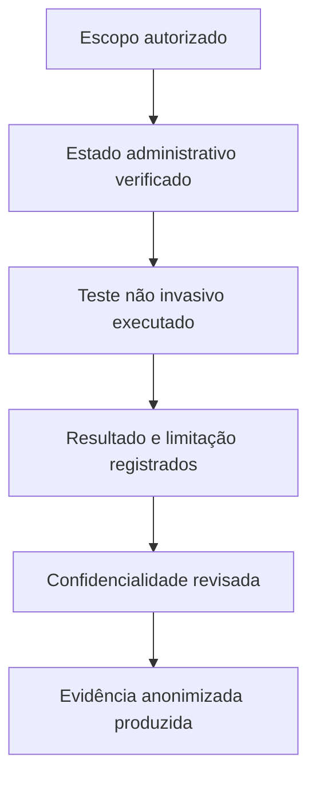

# Processo de validação adotado

```mermaid
flowchart TB
    SCOPE["Escopo autorizado"] --> ADMIN["Estado administrativo verificado"]
    ADMIN --> SAFE["Teste não invasivo executado"]
    SAFE --> RECORD["Resultado e limitação registrados"]
    RECORD --> REVIEW["Confidencialidade revisada"]
    REVIEW --> OUTPUT["Evidência anonimizada produzida"]
```

A validação utilizou estados administrativos e uma conta autorizada, sem acesso ao conteúdo ou às credenciais dos colaboradores.