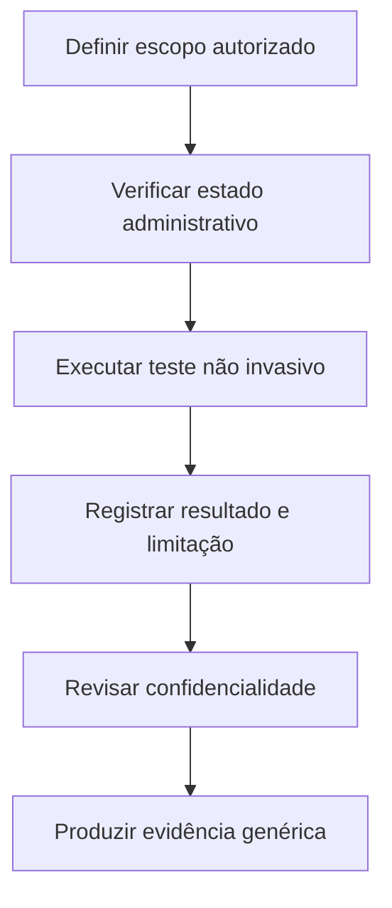

# Processo de validação

```mermaid
flowchart TB
    SCOPE["Definir escopo autorizado"] --> ADMIN["Verificar estado administrativo"]
    ADMIN --> SAFE["Executar teste não invasivo"]
    SAFE --> RECORD["Registrar resultado e limitação"]
    RECORD --> REVIEW["Revisar confidencialidade"]
    REVIEW --> OUTPUT["Produzir evidência genérica"]
```

O processo prioriza evidências administrativas e contas autorizadas, sem acesso a conteúdo de terceiros.
