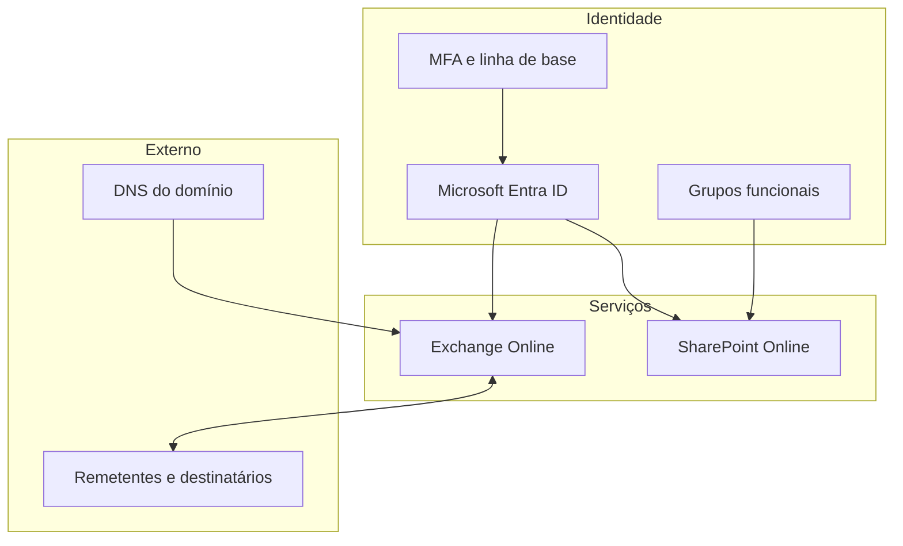

# 04 — Arquitetura

## Visão lógica

## Componentes

| Componente | Responsabilidade no projeto |
|---|---|
| Microsoft Entra ID | Identidades, grupos e linha de base de autenticação |
| Microsoft 365 Admin Center | Administração de domínio, usuários e licenças |
| Exchange Online | Caixas, aliases e distribuição de mensagens |
| SharePoint Online | Site de equipe, bibliotecas e versionamento |
| Microsoft Defender | Estado de autenticação de e-mail e avaliação de segurança |
| DNS | Validação, roteamento e autenticação do domínio |
| Microsoft Authenticator | Segundo fator na validação administrativa |

## Fronteiras de confiança

- A identidade é autenticada pelo Microsoft Entra ID antes do acesso aos serviços.
- O acesso documental é determinado por associação a grupos.
- O tráfego de e-mail depende de registros DNS publicados externamente.
- Evidências administrativas pertencem à fronteira privada e não fazem parte da arquitetura pública.

## Dados propositalmente omitidos

- quantidades de usuários, caixas, grupos e bibliotecas;
- nomes de funções e departamentos;
- relações reais entre grupos e recursos;
- endereços, domínios, URLs e IDs;
- valores e seletores DNS;
- configurações excepcionais de pastas ou itens.

Diagramas complementares estão no diretório [diagrams](../diagrams/).
