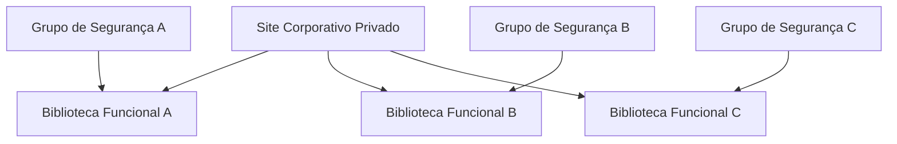

# 07 — SharePoint Online e OneDrive

## SharePoint Online

Foi implantado um site de equipe privado para colaboração documental. O conteúdo foi organizado em bibliotecas funcionais, associadas a grupos baseados em função.

## Organização abstrata

Essa representação é ilustrativa. A quantidade, os nomes e as associações não reproduzem o ambiente real.

## Permissões

- Acesso operacional associado a grupos.
- Administração mantida por identidade proprietária dedicada.
- Ausência declarada de concessões diretas como modelo principal.
- Usuários com nível de edição podem criar, alterar e excluir conteúdo dentro do escopo autorizado.

Permissões exclusivas de pastas ou itens sensíveis foram omitidas integralmente e não constam em tabelas, diagramas, imagens ou exemplos públicos.

## Versionamento

As bibliotecas foram configuradas de forma padronizada com criação de versões principais. Uma biblioteca foi utilizada como amostra de inspeção, e o responsável confirmou a equivalência nas demais.

Os valores exatos de retenção e parâmetros internos não são necessários para demonstrar a atividade e foram omitidos.

## Compartilhamento

O site permaneceu privado. A capacidade administrativa de colaboração externa foi analisada para uso futuro, mas não havia usuários convidados no estado observado.

Os parâmetros exatos de compartilhamento são tratados como postura operacional e permanecem fora da documentação pública.

## OneDrive

O OneDrive apareceu nas configurações organizacionais relacionadas ao compartilhamento, porém não há evidência de uma implantação individual ou projeto específico de OneDrive. Por isso, ele não é apresentado como entrega independente.
