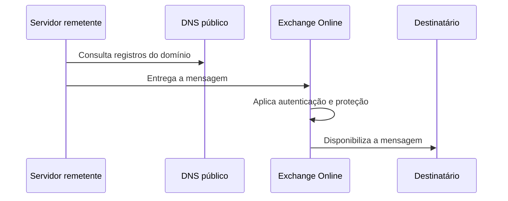

# 08 — Segurança de e-mail

## Objetivo

Reduzir falsificação de remetente e assegurar que o domínio corporativo utilizasse os mecanismos compatíveis com o Exchange Online.

## Controles confirmados

| Controle | Estado documentado | Evidência pública |
|---|---|---|
| Validação de domínio | Concluída | Descrição genérica |
| Roteamento de e-mail | Configurado | Descrição genérica |
| SPF | Configurado | Valor real omitido |
| Descoberta automática | Configurada | Destino real omitido |
| DKIM | Domínio personalizado válido e habilitado | Seletores omitidos |
| DMARC | Registro publicado e resolvido | Política exata omitida |

## Fluxo conceitual

O fluxo é conceitual e não representa cabeçalhos, conectores ou políticas específicas.

## DKIM

A evidência posterior mostra o domínio personalizado com estado válido e assinatura habilitada. Registros de seleção e destino não são reproduzidos neste repositório.

## DMARC

Uma consulta DNS confirmou a publicação do registro. A política observada correspondia a uma etapa inicial sem aplicação restritiva. O valor exato e qualquer parâmetro de relatório permanecem privados.

## Registros legados

Durante a revisão da zona DNS, foram identificados registros associados ao ambiente anterior. Eles não foram removidos porque suas dependências não estavam integralmente inventariadas e uma alteração poderia causar impacto em produção.

Essa decisão representa controle de mudança. Uma futura limpeza deverá exigir:

- inventário das dependências;
- exportação ou backup da zona;
- aprovação do cliente;
- janela de manutenção;
- plano de reversão;
- validação posterior.

## Evidências

As capturas e o PDF originais contêm domínio, IPs, URLs, valores DNS e metadados. Eles são evidências privadas e não devem ser adicionados ao Git.
