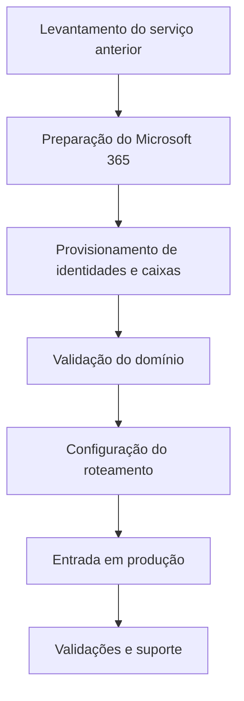

# 09 — Transição de serviços

## Classificação correta

A atividade realizada deve ser classificada como implantação e transição do serviço de e-mail. Não houve migração de mensagens históricas nem importação de arquivos PST ou transferência IMAP.

Também não houve migração documental inicial, pois não existia um acervo de origem definido para esse fim.

## Processo executado

## Dados históricos

Os dados do serviço anterior não foram considerados necessários para a nova operação. A documentação não afirma perda zero, migração integral ou equivalência de conteúdo, pois nenhuma dessas atividades ocorreu.

## Continuidade

Registros legados potencialmente associados a outros serviços foram preservados. A remoção sem inventário, aprovação e plano de reversão poderia introduzir indisponibilidade fora do escopo do projeto.

## Resultado conhecido

O Exchange Online passou a operar como plataforma de e-mail corporativo. A continuidade posterior foi acompanhada por suporte administrativo, sem acesso indevido às caixas dos colaboradores.
