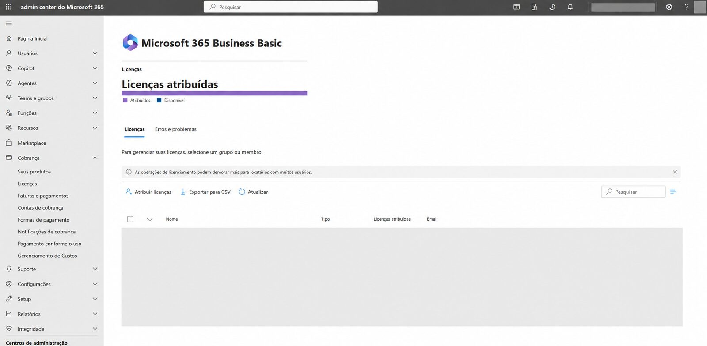
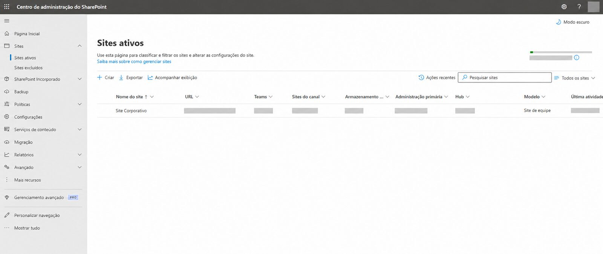
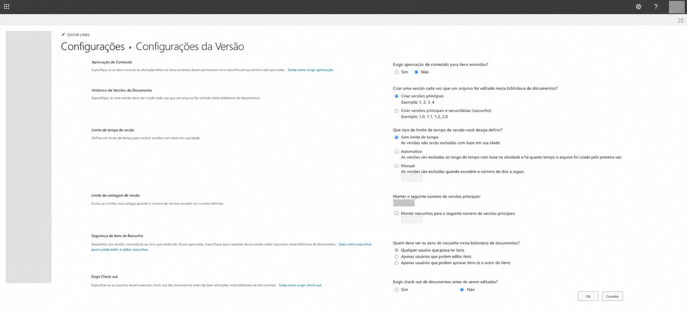
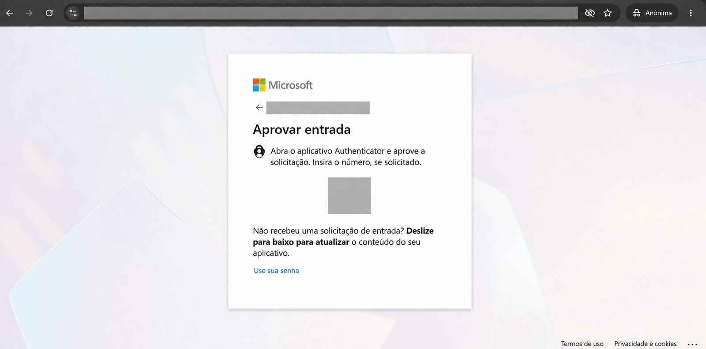

# 14 — Evidências públicas

## Estratégia adotada

O repositório combina documentação textual, diagramas genéricos e uma seleção reduzida de capturas tratadas. Nenhum arquivo original foi incluído.

As imagens abaixo têm finalidade ilustrativa e demonstram as interfaces e os tipos de verificação utilizados. Tarjas e substituições eliminam dados do cliente e, por isso, as capturas não devem ser usadas como inventário, matriz de acesso ou reprodução exata da configuração privada.

## Evidências privadas analisadas

Foram analisadas, exclusivamente como fonte de reconstrução:

- telas de domínio e integridade DNS;
- inventário de licenças e caixas;
- configuração de lista de distribuição;
- lista de grupos de segurança;
- sites e bibliotecas do SharePoint;
- páginas de permissões;
- configuração de versionamento;
- configuração de compartilhamento;
- habilitação dos Padrões de Segurança;
- fluxo de MFA administrativo;
- estado de DKIM;
- resolução de DMARC;
- avaliação de postura;
- exportação em PDF de painel DNS.

Esses arquivos não acompanham o repositório porque contêm dados pessoais, domínio, URLs, IDs, valores DNS, estrutura interna, postura de segurança ou metadados.

## Galeria tratada

### Licenciamento do serviço

Preserva o produto administrado e a tela de licenciamento. Quantidades, datas, usuários e endereços foram omitidos.

### Site de equipe

Preserva o tipo do site. Nome, URL, armazenamento, administração, atividade e demais identificadores foram removidos.

### Administração por grupos

Preserva o uso do recurso de grupos de segurança. Nomes reais, quantidades, endereços, datas e relações de acesso foram removidos ou substituídos por rótulos genéricos.

### Versionamento documental

Preserva a interface e a confirmação visual de versionamento. Bibliotecas e parâmetros numéricos capazes de revelar a configuração detalhada foram omitidos.

### Padrões de Segurança

Preserva o estado habilitado do controle confirmado no projeto. Tenant, organização e conta autenticada foram removidos.

### Fluxo de MFA

Preserva a etapa de aprovação no Microsoft Authenticator. Conta e desafio numérico foram removidos; a validação foi realizada somente em conta administrativa autorizada.

### Validação de registros DNS

Preserva apenas os tipos de registro e os indicadores visuais de integridade. Domínio, provedor, nomes, destinos, valores e TTL foram removidos.

### DKIM

Preserva o estado válido e habilitado do domínio personalizado. Nome do domínio, domínio automático do tenant e dados auxiliares foram removidos.

### Consulta DMARC

Preserva o uso do `Resolve-DnsName` e a existência de resposta TXT. Domínio, resolvedor, TTL e política foram removidos integralmente.

## Representações públicas complementares

| Evidência técnica | Representação pública |
|---|---|
| Arquitetura do ambiente | Diagrama Mermaid genérico |
| Organização documental | Diagrama com bibliotecas fictícias |
| Fluxo de e-mail | Diagrama conceitual |
| Segurança de identidade | Capturas tratadas e descrição dos controles confirmados |
| DNS | Capturas tratadas e tabela de tipos de controles, sem valores |
| Testes | Matriz de validação com limitações |
| Permissões | Explicação de administração por grupos |

## Capturas deliberadamente excluídas

Não foram incluídas telas contendo:

- listas de usuários, caixas ou endereços;
- inventário de aliases e respectivas caixas;
- documentos, arquivos ou pastas reais;
- lista de distribuição e seus membros;
- proprietários do site;
- permissões exclusivas ou matriz de acesso;
- configuração detalhada de compartilhamento externo;
- pontuação ou recomendações detalhadas de postura;
- painel ou exportação original do provedor DNS.

## Regra para novas imagens

Uma imagem só poderá ser adicionada se for necessária, integralmente anonimizada, livre de metadados e aprovada em revisão humana. A simples aplicação de desfoque ou tarja não é suficiente quando o contexto ainda permite identificar o ambiente. A versão anonimizada foi autorizada para divulgação. Novas imagens continuam condicionadas à revisão humana e às mesmas exigências de anonimização.
